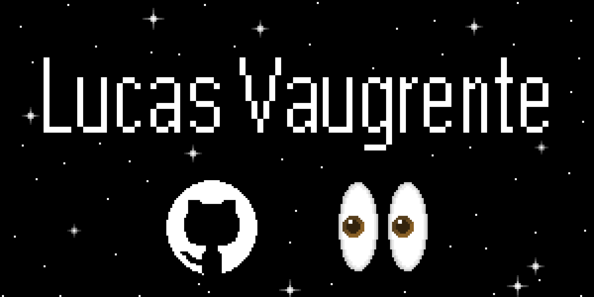
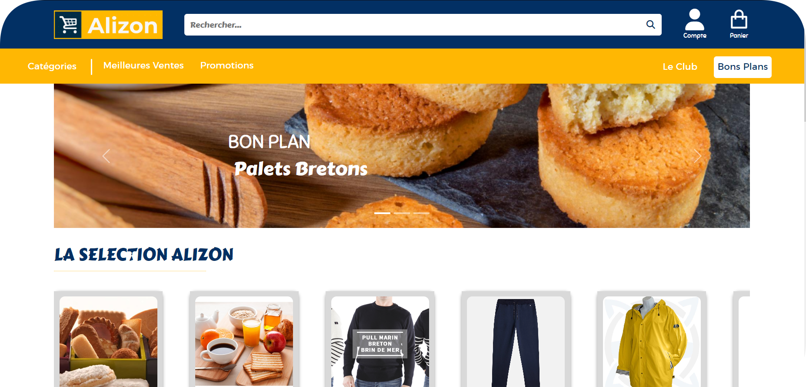
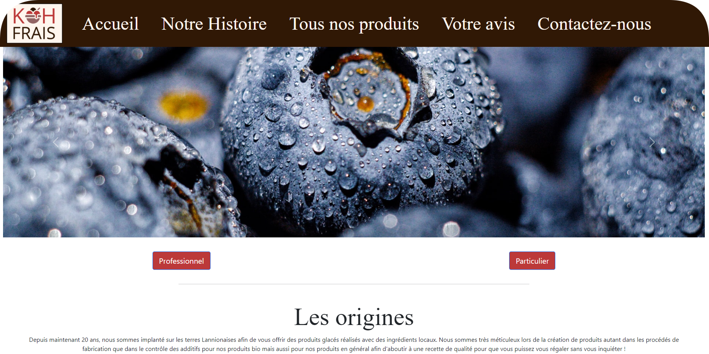
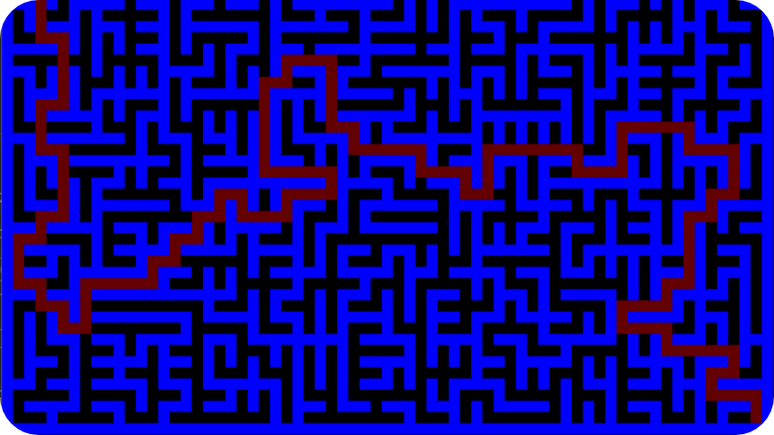

<h1>📮 Contacts</h1>

	
	
	
	

<h1>🙎‍♂️ Myself</h1>

Currently, I'm in my first year of a master's degree in computer science "Smart Computing", a course designed to integrate students into research. I'm doing this course at the moment to discover this world by working with research teams in laboratories to improve my skills too.

I really like volleyball, watch movies and animes, drawing on pixel art and cleaning 🫠.

<h1>📜 Projects</h1>

<h2><a href="https://github.com/8Paprika5/BUT-IUT-Lannion-2021_2024/tree/main/BUT2-2022_2023/Alizon">Website e-commerce Alizon 🧈</a></h2>

This project is a marketplace for the sale of Breton products. It meets the needs of a fictitious customer. This project, in a group of 7, was managed using the AGILE method, with me as Scrum Master.

	<a href="https://github.com/8Paprika5/BUT-IUT-Lannion-2021_2024/tree/main/BUT2-2022_2023/Alizon"></img></a>

<h2><a href="https://github.com/LucasVaugrente/Yams">Yams 🎲</a></h2>

This project is a simulation of the Yams game, using the same rules as the real thing, between two players. It required several stages to be completed, such as layout, test book, program in natural algorithmic language and documentation.

	<a href="https://github.com/LucasVaugrente/Yams"></img></a>

<h2><a href="https://github.com/LucasVaugrente/Site_KohFrais">Website Koh Frais 🍨</a></h2>

This project is a website created in a group of 4 based on a fictitious interview. With all the information gathered, I made with my team: a synthesis of the expressions of needs, the tree structure of the site, the graphic charter, the layout with the content of the pages and finally the realization of the site.

	<a href="https://github.com/LucasVaugrente/Site_KohFrais"></img></a>

<h2><a href="https://github.com/LucasVaugrente/Space_Invaders">Labyrinth 🧮</a></h2>

This project is a labyrinth generator that displays an auto-resolution. This one was done by two people in high school. The algorithm used is Kruskal's. We had also planned to make a character with characteristics that the user would have to control to traverse the labyrinth without the resolution.

	<a href="https://github.com/LucasVaugrente/Labyrinthe"></img></a>

<h2><a href="https://github.com/LucasVaugrente/Space_Invaders">Space Invaders 👽</a></h2>

This project is a reproduction of the “Space Invaders” video game, which consists in eliminating obstacles approaching us by moving from left to right. You can save your score with a personalized nickname before starting a game.

	<a href="https://github.com/LucasVaugrente/Space_Invaders"></img></a>

<h1>📋 Skills</h1>

<table align="center" style="width:90%">
	<thead>
		<th>Software Development</th>
		<th>Frontend</th>
		<th>Backend</th>
	</thead>
	<tr>
		<td>C</td>
		<td>HTML</td>
		<td>Python</td>
	</tr>
	<tr>
		<td>Java</td>
		<td>CSS</td>
		<td>NodeJS</td>
	</tr>
	<tr>
		<td>Python</td>
		<td>SCSS</td>
		<td>CodeIgniter</td>
	</tr>
	<tr>
		<td>Bash</td>
		<td>JavaScript</td>
		<td>PHP</td>
	</tr>
	<tr>
		<td>Docker</td>
		<td>Bootstrap</td>
		<td>MySQL</td>
	</tr>
	<tr>
		<td>JavaFX</td>
		<td>Vue.JS</td>
		<td>PostgreSQL</td>
	</tr>
	<tr>
		<td>PHP</td>
		<td>JQuery</td>
		<td></td>
	</tr>
	<tr>
		<td></td>
		<td>ReactJS</td>
		<td></td>
	</tr>
</table>

I use Git to store my projects, i also used Subversion Control, but I'm really familiar with GitHub and Gitlab.

