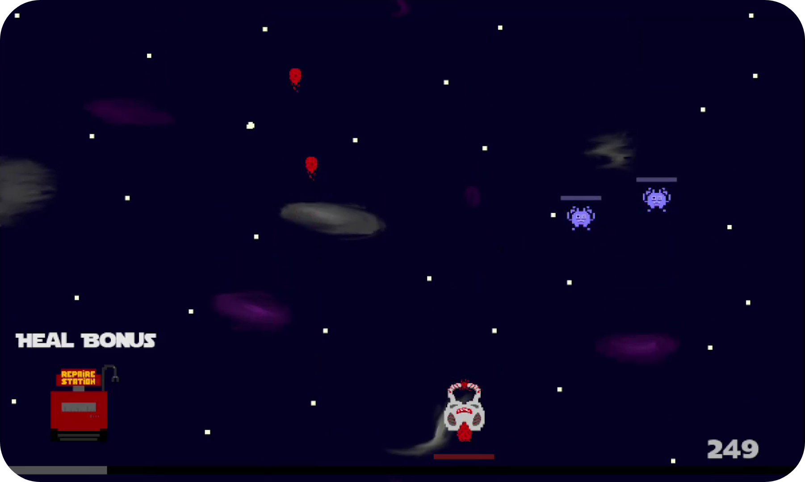

<h1 align="center">
	
</h1>

<h1 align="center">Bienvenue sur mon dépôt GitHub !</h1>

💬 Sur ce dépôt, vous trouverez tous mes projets que j'ai réalisé jusqu'à maintenant.

📫 Vous pouvez me contacter via cette adresse mail : <a href="mailto:lucasvaugrente35@gmail.com">lucasvaugrente35@gmail.com</a>. Si vous voulez plsu d'informations, vous pouvez consulter mon site <a href="https://lucasvaugrente.fr" target="_blank">lucasvaugrente.fr</a>.
	
<h1 align="center">Mes projets</h1>

<h2><a href="https://github.com/LucasVaugrente/Space_Invaders">2020 - Space Invaders 👽</a></h2>

Ce projet est une reproduction du jeu vidéo "Space Invaders", qui consiste à éliminer des obstacles qui s'approchent de nous en se déplacant de gauche à droite. On peut enregistrer notre score avec un pseudo personnalisé préalablement choisi avant de commencer une partie.

<a href="https://github.com/LucasVaugrente/Space_Invaders" ></img></a>

<!--
**LucasVaugrente/LucasVaugrente** is a ✨ _special_ ✨ repository because its `README.md` (this file) appears on your GitHub profile.

Here are some ideas to get you started:

- 🔭 I’m currently working on ...
- 🌱 I’m currently learning ...
- 💬 Ask me about ...
- 📫 How to reach me: ...
-->
